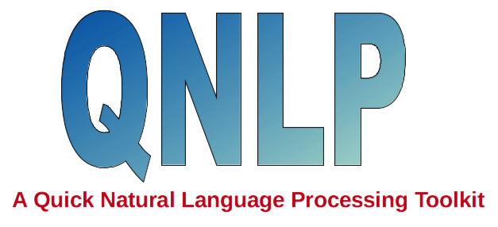

  

# Welcome to Project QNLP
 QNLP is a python-based deep learning natural language processing toolkit for Chinese text classification and sentiment analysis (both Traditional and Simplified Chinese). It helps users finish a job such as analysis of high-frequency words, building deep learning models, and prediction of unlabeled data with only few commands (usually 3~5 lines). QNLP consists of three pars:   

 * count high-frequency words (NLP_stat): this module helps users quick load, clean and tokenize your Chinese text data. Then perform word counting on the whole dataset and output a word frequency plot. Users can have a simple and quick impression of the data. 
 
 * build deep learning models: this module helps user preprocess (tokenize, convert to word vectors, split to training and test dataset) the text data, build deep learning RNN models and evaulate the model. QNLP has a pre-designed RNN framework that should be compatiable with most scenarios. Users can still fine-tuned several hyper-parameters such as depth of the RNN, cell of the RNN (Simple RNN, LSTM, GRU), direction of the RNN (unidirectional, bidirectional). Once the model has been built, QNLP can train the model using various optimizers (e.g., SGD, RPMprop, Adam) and evaulate its performance automatically. 
 
 * prediction of unlabeled data: This module helps users to quickly analyze unlabeled data using the pretrained model. 

 # Background
 Text classification and sentiment analysis are very common problems in the field of Natural Language Processing and deep learning. This project doesn't intend to provide a highly flexible library for general purpose. Instead, this project aims to help users use as less commands as possible to do text classification and sentiment analysis without losing minimal flexiblity.

 As for deep learning, QNLP can help usrs quickly preprocess the data and use Keras and Tensorflow as backends to perform deep learning calculations. Users can build and train the model with a fews inputs.

 QNLP allows users to store the results in Pickle format for every processing step, so users can reload the results for other calculations which makes QNLP not only conveinent for text classification but also good for data preprocessing.  

 # Deep Learning Models
 To help users quickly build deep learning models, QNLP provides two typical models which uses RNN and n-gram CNN respectively. 

 ## RNN
 Using RNN to deal with text data is so natural. Each token is represented as a one-hot encoder vector and send to a embedding layer for dimensional reduction. We emphasize that QNLP doesn't use any pretrained static word embedding. All the embedding parameters are trained dynamically. These embedding word vectors will be sent to a deep RNN layer (users defint the depth) and finally a dense layer to output probability. An illustration is shown below:   

<em> An illustion of RNN with depth=3</em>

In this model, the users need to define the size of the embedding layer, the cell of RNN layer (Simple RNN, LSTM, GRU), the size of each cell, the depth of the RNN layer (in the figure, the depth is set 3), and finall the size of a  dense layer for fine tuning. The last dense layer is to output probability which will always be the size of the categories in your data. Besides, each RNN cell also comes with dropout to prevent from overfitting, so the dropout rate is also an input to the model. 

In general, RNN is more expensive and more difficult for training. Therefore, it is recommend to consider n-gram CNN first. 

## n-gram CNN
n-gram CNN is a new and popular approach for text classification. It was first proposed by [Yoon Kim (arXiv:1408.5882)](https://arxiv.org/abs/1408.5882) from NYU in 2014. This paper was cited more than 2000 times within three years. After that, many improved version appeared such as  [Y. Zhang & B. Wallace (arXiv:1510.03820)](https://arxiv.org/abs/1510.03820) , which is also the framework we used here. An illustration is shown below:   

<em>illustion of n-gram CNN with three different n</em>

In this model, the users need to specify "n" in the n-gram. The more "n" you assigned, the more branches in the neural network. If you have no idea which "n" to use, try n_gram = [2,3,4] first. If so, you will find three convolution layers as shown above. Then the outputs will be sent to global max pooling layers and the output layers through a dropout layer. Similarly, the last dense layer will have the same size as the number of categories in your data, so you don't have to specify its size. 

Based on the discussion above, the hyperparameters are much less than RNN. Also the speed and its performance were found much better than RNN. Therefore, we always recommend users to try this model first.  

 # Requirement:
 To use QNLP, please make sure you have the follow python package installed:  
 * numpy, matplotlib, seaborn, pandas, sklearn, nltk (Already inculded in Anaconda). 

 * autocorrect, tensorflow, keras, tqdm (not inculded in Anaconda). 

 * graphviz, pydot ([optional, only if you want output your model as a png file](https://keras.io/#installation))

 # Instillation:
 Download the project, unzip it, add /QNLP to your python path.     

 # Usage:
 * To perform a calculation, just create an instance of corresponding QNLP object. Then follow the procedure below to complete your calculation.   

 * The order of the following command are not interchangable (you cannot perform a calculation without loading the data first, right?). However, you can perform each command separately, e.g. if you already performed freq.load_data() in your previous execution, the next time you can simply run freq.run_stat() without doing freq.load_data() again since the method load_data will save a pickle file in work_dir/output and, in a subsequent command, QNLP will automatically load for the Pickle file. Similar idea applies to all the other QNLP objects.    
 
 *  Also note that, by defult, you don't have to return any variable of each method. You will need these returns unless you want to further process the data using your own codes.    
 
 *  The meaning of each variables can be found in the "doc" folder

 * procedure of a task:
	 * High-Frequency:
	 

	  
	 

	 * build deep learning model:
	 

	  
	 

 
	 * predict unlabel data:
	 

	  
	 

## How to use your own deep learning models?
If you're not satisified with the default deep learning models, you can build your own models using Keras. Save the model as a keras model object in work_dir/output/model.h5. Then the later methods such as model.train and model.test will automatically load the model. 

